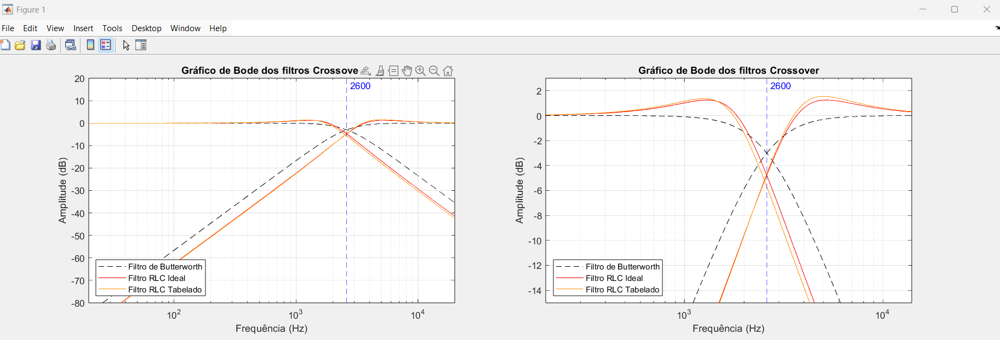

# Trabalho de filtro Butterworth crossover

### Hellen Heidemann Fontanella

---

### Problema

Este projeto tem como objetivo criar um filtro crossover passivo com saída em duas vias, baseado no filtro de Butterworth, para separar as faixas de frequência em alto-falantes próprios para reprodução.

### Objetivos

O filtro de Butterworth é um modelo ideal de um filtro passa baixas. Usando sua função de ganho por frequência é possível modelar um filtro RLC equivalente.

A partir da frequência de corte $f = 2600 \ \text{Hz}$ e da impedância da carga $R = 6 \ \Omega$, pode-se calcular os valores ideais de $L$ e $C$ para ambos os filtros.

Também é possível fazer uma transformação de filtro para determinarmos os valores do filtro RLC passa-altas.

### Funções e fórmulas

Função de ganho em frequência de Butterworth passa-baixas e passa-altas (frequência normalizada):
$$
G(\omega) = \dfrac{1}{\sqrt{1 + \omega^{2n}}} \quad (1.0)
$$

$$
G(\omega) = \dfrac{\omega^2}{\sqrt{1 + \omega^{2n}}} \quad (1.1)
$$

Coeficientes para filtro RLC passa-baixas em topologia de Cauer:

$$
C_k = 2\sin \left[\dfrac{(2k - 1)}{2n}\pi \right] , k = \text{ímpar} \quad (2.0)
$$

$$
L_k = 2\sin \left[\dfrac{(2k - 1)}{2n}\pi \right] , k = \text{par} \quad \ \ \ \  (2.1)
$$

Mudança de escala de frequência e impedância:

$$
L = \dfrac{\omega_c' \ R}{\omega_c \ R'}L \quad (3.0)
$$

$$
C = \dfrac{\omega_c' \ R'}{\omega_c \ R}C \quad (3.1)
$$

Trasformação de filtro RLC passa-baixas para passa-altas:

$$
L' \rarr C = \dfrac{1}{ L'} \quad (4.0)
$$

$$
C' \rarr L = \dfrac{1}{ C'} \quad (4.1)
$$

Funções de transferência de filtros RLC passa-baixas e passa-altas de segunda ordem:

$$
H(s) = \dfrac{1}{LCs^2 + RCs +1} \quad (5.0)
$$

$$
H(s) = \dfrac{LCs^2}{LCs^2 + RCs +1} \quad (5.1)
$$

### Lógica do programa

Foi utilizado a topologia de Cauer para determinar os coeficientes de um filtro RLC protótipo passa-baixas, e também foram determinados os coeficientes do filtro passa-altas fazendo uma inversão do valor de reatância.

Após isso, foi efetuado uma mudança de escala de frequência e impedância para todos os coeficientes, configurando ambos os filtros com os valores ideais, assim formando uma resposta congruente com o filtro ideal de segunda ordem.

Depois foi gerado o Gráfico de Bode em todo o espectro audível e ao lado uma aproximação da frequência de corte.

Os resultados dos valores de $L$ e $C$ para os filtros são disponibilizados na janela de comando.

### Guia de uso

Abrir o código no MATLAB e executar. Os gráficos serão gerados em uma figura e os resultados serão mostrados na janela de comandos.

### Análise de resultados

Os resultados são:

>Indutor de passa-baixas idealizado: $5.1941 \cdot 10^{-4}\ H$ \
>Capacitor de passa-baixas idealizado: $1.4428 \cdot 10^{-5}\ F$ \
>Indutor de passa-altas idealizado: $2.5971 \cdot 10^{-4}\ H$ \
>Capacitor de passa-altas idealizado: $7.2141\cdot 10^{-6}\ F$

>Indutor de passa-baixas real:  $5.6 \cdot 10^{-4}\ H \ (0.56 \ mH)$ \
>Capacitor de passa-baixas real: $1.5 \cdot 10^{-5}\ F \ (15 \mu F)$ \
>Indutor de passa-altas real: $2.7 \cdot 10^{-4}\ H \ (0.27 mH)$ \
>Capacitor de passa-altas real: $6.8 \cdot 10^{-6}\ F \ (6.8 \mu F)$

O filtro RLC tem um comportamento muito próximo do filtro ideal de Butterworth.

É perceptível que ambos os filtros RLC possuem uma curva de _overshoot_ na amplitude quando se aproximam da frequência de corte. O filtro RLC de valores comerciais tem uma curva mais acentuada. Esse ganho de amplitude é de cerca de $1.5 dB$, o que faz uma diferença pequena na reprodução do sistema.

||
|:--:|
|Gráficos de Bode dos filtros Crossover|

### Conclusões

O projeto alcançou o objetivo, que era achar os valores para a construção de um filtro crossover baseado no filtro de Butterworth de segunda ordem.

A limitação dos componentes reais mostra que, para alcançar a melhor aproximação dos ideais matemáticos, é necessário uma análise mais profunda da implementação da solução e a correção dos problemas que surgem pela não exatidão dos elementos utilizados.